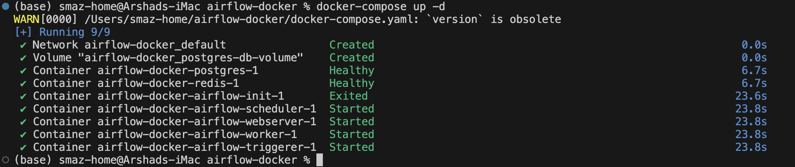
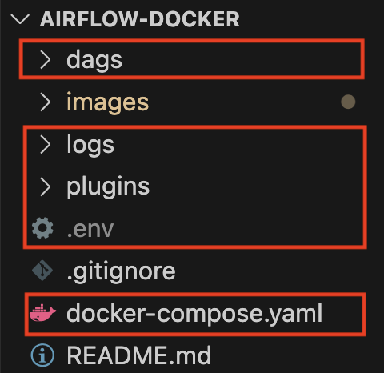
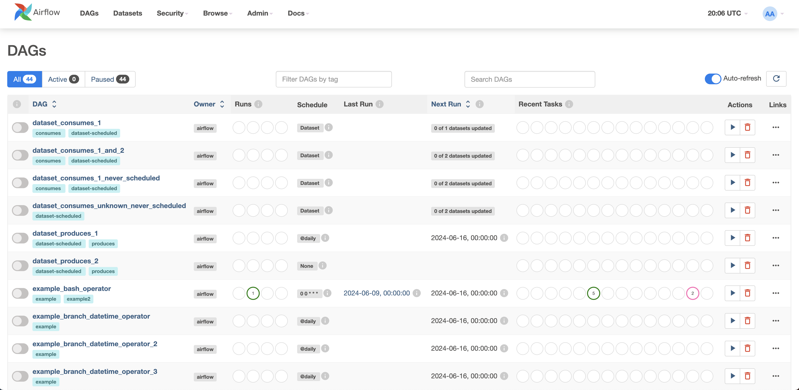

Installing Apache Airflow via Docker
------------------------------------
1. Create a folder, for e.g. `airflow-docker`. Within the folder, download the docker compose file from [here](https://airflow.apache.org/docs/apache-airflow/2.5.1/docker-compose.yaml) and save it as `docker-compose.yaml`.

2. Create a `.env` file within folder and copy the following:

	~~~
	AIRFLOW_IMAGE_NAME=apache/airflow:2.4.2
	AIRFLOW_UID=50000
	~~~

2. Open the terminal and go that folder, and type `docker-compose up -d`.

    

	There will be some additional folders that would be created as shown below:

	

With this command, docker installs airflow within it. To check, open a web browser and go to `localhost:8080` and you will see something like below:

3. Login through the airflow page using the following credentials:
	~~~
	Username : airflow
	Password : airflow
	~~~

4. Once you have logged in, the following page would be displayed

