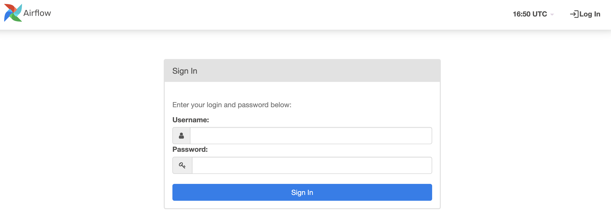

Introduction
------------
**Apache Airflow** is an open-source platform for authoring, scheduling and monitoring data and computing workflows. Airflow is the de-facto standard for defining ETL/ELT pipelines as Python code.

**Docker** is a software platform that allows you to build, test, and deploy applications quickly. Docker packages software into standardized units called containers that have everything the software needs to run including libraries, system tools, code, and runtime.

Installing Apache Airflow via Docker
------------------------------------
1. Create a folder, for e.g. `airflow-docker`. Within the folder, download the docker compose file from [here](https://airflow.apache.org/docs/apache-airflow/2.5.1/docker-compose.yaml) and save it as `docker-compose.yaml`.

2. Create a `.env` file within folder and copy the following:

	~~~
	AIRFLOW_IMAGE_NAME=apache/airflow:2.4.2
	AIRFLOW_UID=50000
	~~~

2. Open the terminal and go that folder, and type `docker-compose up -d`.

    

	There will be some additional folders that would be created as shown below:

	

With this command, docker installs airflow within it. To check, open a web browser and go to `localhost:8080` and you will see something like below:

3. Login through the airflow page using the following credentials:
	~~~
	Username : airflow
	Password : airflow
	~~~

4. Once you have logged in, the following page would be displayed

Important Notes
---------------
+ Docker Compose (`docker-compose`) is used to run multiple containers as a single service. For example, suppose you had an application which required NGNIX and MySQL, you could create one file which would start both the containers as a service without the need to start each one separately.
+ We can run the docker-compose file using `docker-compose -f {compose file name} up`
+ We can monitor tasks with Flower. In order to access Flower, we have to do `docker-compose down && docker-compose --profile flower up -d`. To check, open a web browser and go to `localhost:5555`
+ We can restart airflow through docker by `docker-compose down && docker-compose up -d`
+ `docker ps` lists all running containers in docker engine. 
+ `docker-compose ps` lists containers related to images declared in docker-compose file 

Airflow has several parameters to tune your tasks and DAGs concurrency. Starting from the configuration settings

+ parallelism / AIRFLOW__CORE__PARALELISM
	- This defines the maximum number of task instances that can run in Airflow per scheduler. By default, you can execute up to 32 tasks at the same time. If you have 2 schedulers: 2 x 32 = 64 tasks.
	- What value to define here depends on the resources you have and the number of schedulers running.

+ max_active_tasks_per_dag / AIRFLOW__CORE__MAX_ACTIVE_TASKS_PER_DAG
	- This defines the maximum number of task instances allowed to run concurrently in each DAG. By default, you can execute up to 16 tasks at the same time for a given DAG across all DAG Runs.

+ max_active_runs_per_dag / AIRFLOW__CORE__MAX_ACTIVE_RUNS_PER_DAG
	- This defines the maximum number of active DAG runs per DAG. By default, you can have up to 16 DAG runs per DAG running at the same time.